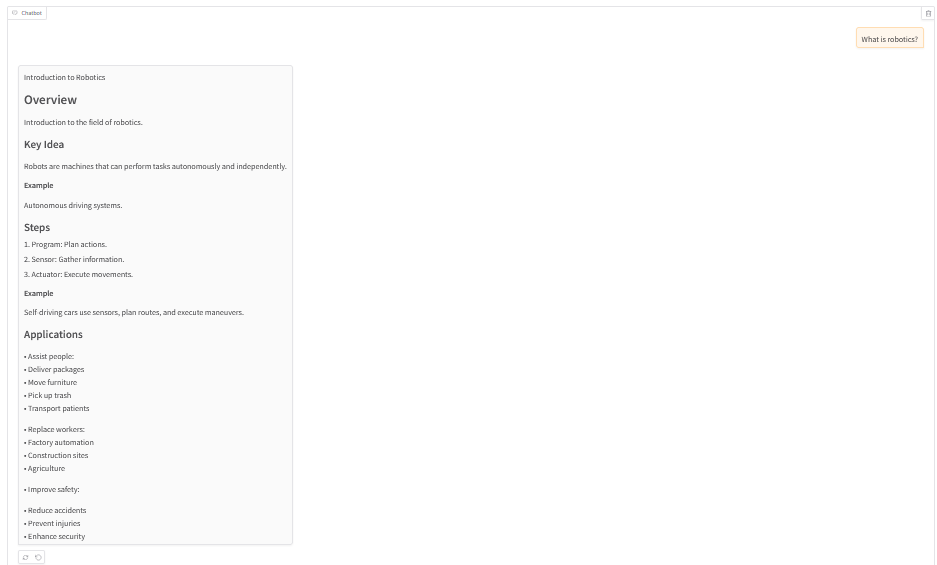

# Robotics and ML-Tutor-LLM

Robotics and ML-Tutor-LLM is an educational AI chatbot designed to explain machine learning and robotics concepts using simplified language,
step-by-step reasoning, and worked examples.

The model is optimized for accessibility rather than purely technical precision, making it useful for beginners and intermediate learners studying topics such as gradient descent, transformers, overfitting, and backpropagation.

The model was trained on a custom educational dataset consisting
of approximately 100 manually curated machine learning and robotics
question-answer pairs. The dataset was manually assembled and refined using AI-assisted
generation workflows to create educational machine learning and
robotics explanations in an instruction-response format.

The dataset emphasized:
- simplified explanations,
- step-by-step reasoning,
- beginner accessibility,
- and example-driven teaching.

## Features

- Step-by-step ML explanations
- Beginner-friendly responses
- Example-driven teaching style
- Lightweight conversational interface
- Failure-aware response analysis
- Transformer-based architecture

## Example Interaction

### User
> What is linear regression in ML?

### Model

> Simple Explanation

>Linear Regression
>Simple Linear Model
>
>Step-by-Step:
>
>1.Calculate slope (w)
>
>2.Calculate intercept(b)
>
>Example: y = w*x + b
>
>Key Idea: Straight Line
>
>Summary:
>
>  - Easy to understand
>  - Predicts well for simple data patterns
>
>Limitations:
>
>  - Not suitable for complex datasets

### User
> What is an actuator in robotics?

### Model

>An ACTUATOR is a device that converts energy into motion. In simple terms, it moves something.
>
>Example: A motor turning a wheel.
>
>Step-by-Step:
>
>1.Energy input (e.g., electricity)
>
>2.Movement output
>
>Key Idea: Motion generation.

## Failure Analysis

The model struggles with:

- overly simplified answers
- ambiguous prompts
- long chain-of-thought reasoning
- highly specialized research terminology

## Example of A Weak Response

### User
>What are support vector machines?

### Model

>Key Idea: Separating Hyperplanes

>Simple Explanation:
>Separate Classes with Lines
>
>Example: Face Recognition
>
>Key Idea: Maximizes Margin
>
>Machine Learning Technique
